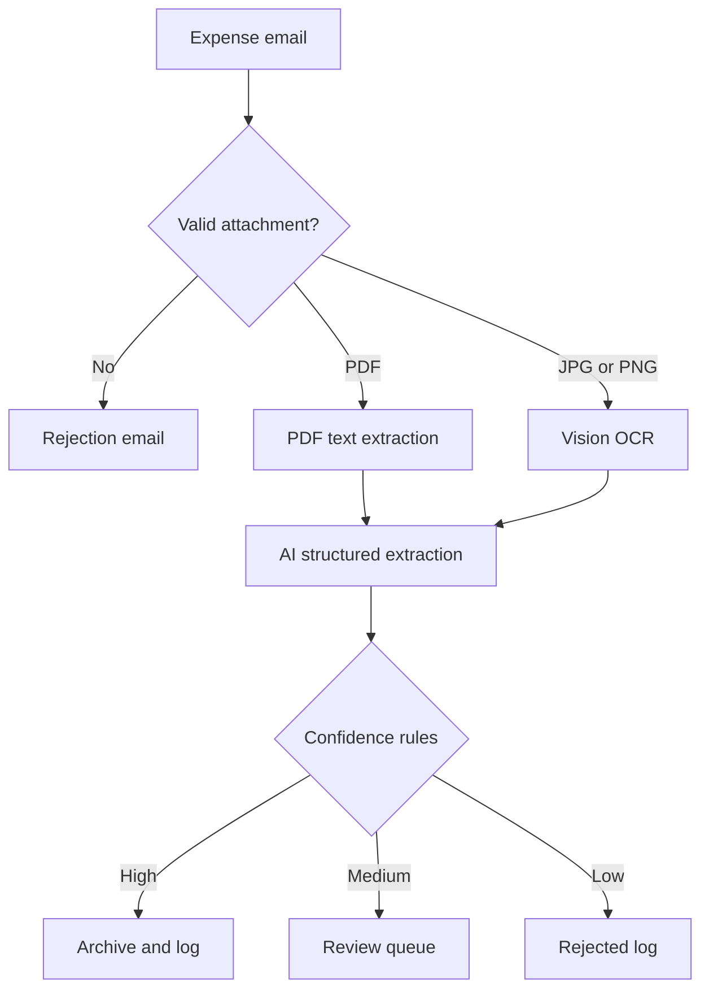

# AI Expense Tracker

An end-to-end n8n workflow that receives expense receipts by email, extracts structured data with AI, applies confidence-based validation rules, archives documents, updates Google Sheets, and sends status notifications.


## Business problem

Manual expense processing is slow, repetitive, and error-prone. Finance teams must open attachments, copy invoice data, classify expenses, store supporting documents, and contact employees when information is missing.

AI Expense Tracker automates that process while keeping uncertain extractions in a human-review queue.

## Main features

- Monitors Gmail for new expense emails.
- Checks that an attachment exists and validates PDF, JPG, and PNG files.
- Extracts text from PDFs and uses OpenAI Vision OCR for images.
- Converts receipt text into structured expense data.
- Routes results according to extraction confidence and amount validity.
- Archives receipts in Google Drive.
- Logs accepted, review-required, and rejected expenses in Google Sheets.
- Sends automatic confirmation, review, rejection, and validation emails.

## Workflow architecture



## Decision rules

| Result | Rule | Action |
|---|---|---|
| `READY_FOR_REVIEW` | Confidence ≥ 0.85 and valid amount | Archive, log expense, send confirmation |
| `NEEDS_REVIEW` | Confidence from 0.60 to 0.84 and valid amount | Archive in review folder, add to review queue, send alert |
| `REJECTED_EXTRACTION` | Confidence < 0.60 or missing/invalid amount | Log rejection and notify sender |

## Extracted fields

| Field | Example |
|---|---|
| `expense_id` | `EXP-20260717-184409` |
| `employee_email` | `employee@example.com` |
| `merchant_name` | `Atlas Digital Test SARL` |
| `expense_date` | `2026-07-01` |
| `total_amount` | `1200` |
| `currency` | `MAD` |
| `tax_amount` | `200` |
| `category` | `SOFTWARE` |
| `payment_method` | `BANK_TRANSFER` |
| `document_number` | `AT-2026-0071` |
| `confidence` | `0.90` |
| `missing_fields` | `[]` |

## Technologies

- n8n
- OpenAI
- Gmail
- Google Drive
- Google Sheets
- JavaScript

## Repository structure

```text
AI-Expense-Tracker/
├── README.md
├── workflow/
│   └── AI-Expense-Tracker.public.json
├── sample-data/
│   ├── expenses.csv
│   ├── review-queue.csv
│   └── test-cases.json
├── assets/
│   ├── workflow.png
│   └── workflow-execution.png
├── docs/
│   └── VIDEO-DEMO-SCRIPT-FR.md
├── .env.example
├── .gitignore
└── LICENSE
```

## Prerequisites

- An n8n instance (Cloud or self-hosted).
- Gmail OAuth2 credentials.
- Google Drive OAuth2 credentials.
- Google Sheets OAuth2 credentials.
- An OpenAI API key.
- Two Google Drive folders: accepted expenses and review queue.
- Two Google Sheets tabs using the columns provided in `sample-data/`.

## Installation

1. Download `workflow/AI-Expense-Tracker.public.json`.
2. In n8n, select **Import from File** and choose the JSON file.
3. Assign your Gmail, Google Drive, Google Sheets, and OpenAI credentials.
4. In **OpenAI Vision OCR**, replace the placeholder authorization value with a secure n8n Header Auth credential. Do not store a real API key in a public workflow file.
5. Select your Google Drive folders in both upload nodes.
6. Select your Google Sheets documents and tabs in all three logging nodes.
7. Verify that **Download Attachments** is enabled in the Gmail Trigger.
8. Run the tests below before activating the workflow.

## Suggested tests

| Test | Input | Expected result |
|---|---|---|
| Valid PDF | Clear PDF invoice with amount and date | Expense logged or routed to review |
| Valid JPG | Clear photo of a receipt | OCR followed by structured extraction |
| Missing field | Receipt without payment method | Field listed in `missing_fields` |
| Low-quality image | Blurred receipt | Review or rejected route |
| Unsupported file | DOCX or ZIP attachment | Unsupported-file email |
| No attachment | Email without a file | No-attachment email |

## Security and privacy

The public workflow contains no credentials, personal email addresses, Google resource IDs, or execution data. For production use:

- store API keys only in n8n Credentials;
- restrict access to Drive folders and Sheets;
- configure an n8n error workflow;
- define a retention policy for receipts;
- review applicable financial-data and privacy requirements.

## Current scope and possible improvements

This portfolio version processes the first supported attachment found in an email. Future improvements can include multi-attachment processing, duplicate detection, approval workflows, budget controls, dashboards, accounting-software integration, and automated error handling.

## Demo

Use the recording plan in `docs/VIDEO-DEMO-SCRIPT-FR.md`, then add the public demo video link here.

## License

Released under the MIT License. See `LICENSE`.
